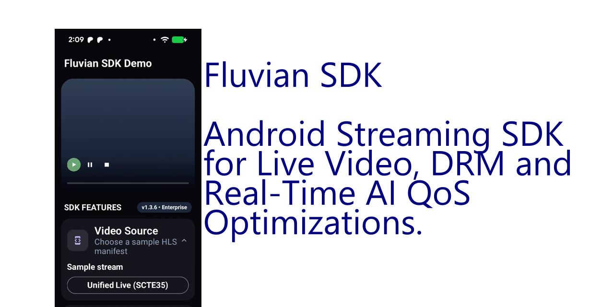

# Fluvian SDK

[](videos/Fluvian_SDK_App_Demo.mp4)


**AI-first Android streaming SDK for live video, DRM, and real-time QoS optimization.**

Build high-performance streaming apps with **production-grade playback + adaptive QoS decision systems**—not just a player wrapper.

---



*Screen recording: commit **`videos/Fluvian_SDK_App_Demo.mp4`** for the player above (see `.gitignore` exception). For full interactive playback and QoS, clone and run **`SDK_DEMO_ANDROID`** in Android Studio.*

## 🚀 Get Started in Minutes

- Clone + run the demo in **under 5 minutes**
- See **real streaming + QoS decision logic in action**
- No API keys, no setup friction

👉 **Start now → clone + run**
👉 **Upgrade to PRO when you need AI optimization**

**Contact:** monigarr@monigarr.com

---

## ⭐ Start Here (Fastest Path)

Choose your path:

- 👨‍💻 **Developer** → Run demo → explore SDK architecture  
- 🚀 **Startup / Product Team** → Ship with Open Core → upgrade to PRO  
- 🏢 **Enterprise / OTT** → Engage for performance + architecture  

👉 Email: **monigarr@monigarr.com**  
👉 Subject: `Fluvian SDK – [Your Use Case]`

---

## Why Fluvian SDK

Most Android video stacks stop at playback.

Fluvian SDK adds a **decision layer** on top of playback:

- Real-time **QoS-driven adaptation**
- AI-ready optimization layer (optional)
- Clean SDK architecture (not a wrapper)
- Privacy-first analytics
- Designed for **production environments**

**Result:** better playback reliability, faster development, and a system that scales.

---

## Who This Is For

- Android developers building video apps  
- Startups launching OTT / streaming products  
- Teams struggling with buffering, latency, or stability  
- Engineers exploring QoS + AI optimization  
- Agencies delivering streaming platforms  

---

## What You Get (Open Core)

This repo is a **fully working streaming SDK**, not a mock or sample.

- Media3-based playback (HLS + DASH)
- DRM-ready architecture
- QoS pipeline (**Measure → Interpret → Execute**)
- AI abstraction layer (no hidden dependencies)
- Demo app with real streams

You can **evaluate the full system locally** with zero external dependencies.

---

## Where PRO Starts

Open Core proves the architecture.

**PRO unlocks production advantage:**

- AI-driven QoS optimization  
- Bandwidth prediction systems  
- Advanced playback tuning  
- Private SDK artifacts (AAR)  

👉 Used when performance = revenue

See [docs/PRICING.md](docs/PRICING.md).

---

## Architecture Boundary

**Open Core (public):**
- StreamingClient API  
- Media3 integration  
- QoS framework  
- AI abstraction layer  

**Licensed layers:**
- Optimization engine  
- Prediction models  
- Production DRM workflows  

Technical contract: [docs/ARCHITECTURE.md](docs/ARCHITECTURE.md)

---

## 🧪 Try It Now

Run the full system locally:

- Real streaming playback  
- QoS monitoring  
- SDK integration patterns  

No API keys. No setup friction.

👉 Clone → open `SDK_DEMO_ANDROID/` → run

---

## Getting Started

1. Clone the repository  
2. Open `SDK_DEMO_ANDROID/` in Android Studio  
3. Run the app  
4. Explore streaming + QoS behavior  

That’s it.

---

## Example Integration

```kotlin
val client: StreamingClient = StreamingClientImpl(
    context = context,
    analytics = myAnalyticsTracker,
    drmConfig = optionalWidevineConfig,
)

client.initialize(StreamConfig(enableBandwidthPredictorHints = true)) {
    client.play("https://example.com/live/playlist.m3u8")
}
```

---

## Work With Fluvian SDK

Fluvian SDK supports:

- Streaming app development
- Playback performance optimization
- AI-driven QoS systems
- White-label SDK integrations

## Get Started

- Evaluate with Open Core
- Upgrade to PRO for production
- Engage Enterprise for scale

👉 monigarr@monigarr.com

Response time: ~24 hours

---

## Legal and repository policies

| Document | Purpose |
|----------|---------|
| [LICENSE](LICENSE) | Proprietary terms (evaluation / no redistribution without permission) |
| [docs/EVALUATION_TERMS.md](docs/EVALUATION_TERMS.md) | Plain-language evaluation rules |
| [CONTRIBUTING.md](CONTRIBUTING.md) | How to report issues and contribute |
| [SECURITY.md](SECURITY.md) | How to report vulnerabilities privately |
